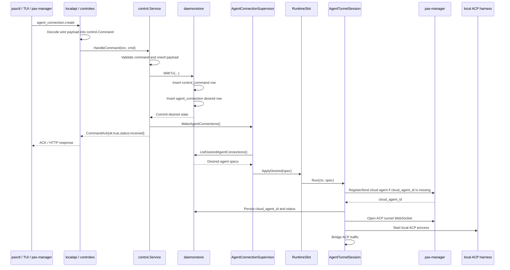
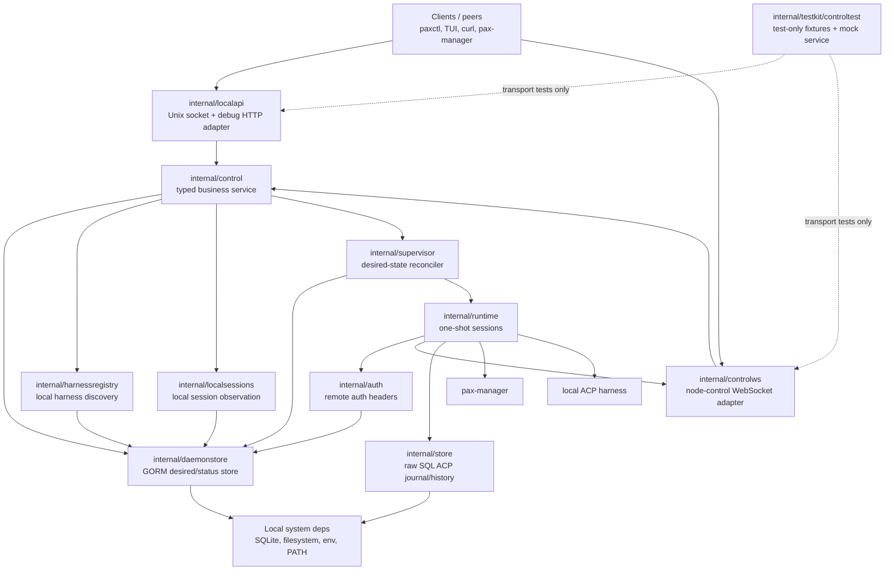

# paxd daemon/client split plan

## Current state

- `paxd run` reads YAML config and starts runtime services from that static snapshot.
- ACP forwarding is already one WebSocket per enabled agent connection.
- There is no node-control WebSocket today.
- Remote node and agent commands currently arrive through HTTP mailbox polling.
- `internal/cloud/ws.go` exists, but the main daemon loop does not wire it in.
- `cmd/paxd/main.go` mixes daemon lifecycle, onboarding, configuration, harness inspection, and one-off forwarder commands.

## Target model

Split paxd into two conceptual parts:

- `paxd`: daemon service. It owns long-running runtime state, local storage, remote tunnels, local harness discovery, local session observation, status reporting, and connection supervision.
- `paxctl` / TUI / other clients: local clients. They modify or observe paxd only through the local control API.

YAML should stop being the source of truth. SQLite becomes the durable local state store for remotes, desired agent connections, runtime status, harness inventory, local session cache, command history, and ACP transport journal.

Hermes HTTP is not part of the target model. The target model is ACP-first plus local harness/session observation.

## Control planes

All control transports should be thin protocol adapters over one shared control service.

```text
paxctl / TUI
  -> Unix socket
      -> localapi handler
          -> control.Service

curl / Postman / browser debug
  -> optional 127.0.0.1 HTTP
      -> localapi handler
          -> control.Service

pax-manager
  -> node-control WebSocket
      -> controlws handler
          -> control.Service
```

Transport adapters:

- Unix socket local API: default local transport for paxctl, TUI, and local programs.
- Optional localhost HTTP debug API: same local API handler over `127.0.0.1` for curl/Postman/browser debugging.
- Remote node-control WebSocket: remote transport between pax-manager and paxd.

The shared `control.Service` owns query handling, desired-state mutation, command idempotency, and supervisor wakeups. Transport adapters must not implement business logic independently.

### Control service boundary

Put all control-plane business logic in `internal/control.Service`.

Transport packages should only translate protocol messages into control queries/commands and encode responses:

```text
internal/localapi   -- Unix socket and localhost debug HTTP handler
internal/controlws  -- remote node-control WebSocket adapter
internal/control    -- shared business service
```

Transport adapters must not write desired-state tables directly. They should not import the GORM store or supervisor packages except through `internal/control`.

Unix socket and localhost debug HTTP should share the exact same `http.Handler`, served on different listeners:

```text
http.Serve(unixListener, localapi.NewHandler(controlService))
http.Serve(localhostDebugListener, localapi.NewHandler(controlService))
```

The remote WebSocket adapter uses a separate protocol adapter, but it calls the same `control.Service`.

Test split:

- `control.Service` tests use real or test stores and assert desired-state changes, generation/restart nonce behavior, idempotency, status reads, and supervisor wakeups.
- Transport adapter tests use a mock control service. They assert that protocol inputs are translated into the expected `control.Query` or `control.Command`, and that mock service results are encoded into the expected protocol responses.
- Transport tests should not assert database state. Business state changes belong only in `control.Service` tests.

### Local control plane

Use a Unix domain socket for local client-to-daemon control.

Default socket:

```text
~/.paxd/paxd.sock
```

The local client should not write config files or start forwarders directly. It should call the daemon, and the daemon should persist desired state and reconcile runtime state.

The optional HTTP debug listener must bind only to localhost by default and should be disabled unless explicitly requested, for example with a daemon flag such as `--debug-http 127.0.0.1:8765`.

Example local endpoints:

```text
GET    /v1/status
GET    /v1/remotes
POST   /v1/remotes
PATCH  /v1/remotes/{id}
DELETE /v1/remotes/{id}
POST   /v1/remotes/{id}/restart

GET    /v1/agent-connections
POST   /v1/agent-connections
GET    /v1/agent-connections/{id}
PATCH  /v1/agent-connections/{id}
DELETE /v1/agent-connections/{id}
POST   /v1/agent-connections/{id}/restart

GET    /v1/harnesses
POST   /v1/harnesses/discover

GET    /v1/local/overview
GET    /v1/local/sessions
POST   /v1/local/sessions/sync
GET    /v1/local/sessions/{session_id}
```

### Remote control plane

Each enabled remote gets one node-control WebSocket.

This is separate from ACP agent tunnels:

```text
pax-manager <-> paxd node-control websocket
pax-manager <-> paxd ACP tunnel websocket <-> local harness
```

The node-control WebSocket is for daemon and machine-level management:

- discover harnesses
- create, update, delete, enable, disable, or restart agent connections
- refresh policy
- collect diagnostics
- upgrade paxd
- report command execution results

The ACP tunnel remains data-plane only. It carries ACP JSON-RPC payloads for a specific agent/session and should not be used for daemon administration.

### Remote auth injection

Remote authentication material belongs to the remote, not to individual agent connections.

Both node-control WebSocket sessions and agent ACP tunnel sessions should obtain headers from one shared provider:

```text
AuthHeadersProvider(remote_id)
  -> reads remote + remote_auth
  -> resolves secret refs through SecretResolver
  -> returns X-Pax-Key and optional CF Access headers
```

Suggested interfaces:

```go
type AuthHeadersProvider interface {
    Headers(ctx context.Context, remoteID string) (http.Header, error)
}

type SecretResolver interface {
    Resolve(ctx context.Context, ref string) (string, error)
}
```

`agent_connection` must not store Cloudflare Access credentials. Agent tunnel sessions reference `remote_id`; auth headers are derived from that remote at runtime.

Resolved secrets must not be logged, returned by debug APIs, shown in TUI, or persisted in command audit results.

## WebSocket cardinality

The desired steady state is:

```text
count(enabled remote rows) node-control WebSockets
count(enabled agent_connection rows) ACP tunnel WebSockets
```

For example, a node with two enabled remotes and four enabled agent connections should have two node-control WebSockets and four ACP tunnel WebSockets.

Do not multiplex node-control and ACP traffic in the first version. Keeping them separate avoids mixing permission boundaries, reconnect behavior, flow control, ACK semantics, and debugging.

## Node-control message semantics

Node-control has two message families:

- Query/request: read-only or cache refresh work, such as status reads and `harness.discover`. These return a direct response and do not enter the command idempotency table.
- Command: mutates desired state, such as remote registration, agent connection create/update/delete/restart, or paxd upgrade. These are persisted in `control_command`.

For commands, synchronous success means the desired state and command record were durably committed. Runtime completion is observed later by polling status. A best-effort `command_result` can be sent over the node-control WebSocket when available, but it is not the source of truth.

Manager sends:

```json
{
  "kind": "command",
  "command_id": "cmd_123",
  "type": "agent_connection.update",
  "payload": {}
}
```

paxd immediately replies:

```json
{
  "kind": "ack",
  "command_id": "cmd_123",
  "ok": true,
  "status": "received"
}
```

The ACK means the daemon received the command and durably committed the desired-state mutation. It does not mean the runtime has fully applied the change.

Rejected command ACKs use `ok=false` and `status=rejected`. Processing failures use `status=failed`.

paxd later may reply:

```json
{
  "kind": "command_result",
  "command_id": "cmd_123",
  "status": "applied",
  "payload": {}
}
```

Every mutating command must be idempotent by `command_id`.

## Desired-state reconciliation

Both local Unix socket requests and remote node-control commands should call the same internal control service.

```text
local paxctl/TUI request
remote node-control command
        |
        v
internal control service
        |
        v
SQLite desired state
        |
        v
supervisors reconcile runtime state
```

Concrete `agent_connection.create` flow:



`control.Service` must not call pax-manager directly. It commits desired state and wakes supervisors; remote registration, `cloud_agent_id` discovery, tunnel dialing, and local process startup belong to supervisor/runtime layers.

## Module responsibilities

- `internal/control`: Shared business control service for typed commands, queries, validation, desired-state mutation, idempotency, query orchestration, and supervisor wakeups.
- `internal/localapi`: Local Unix socket and optional localhost debug HTTP transport adapter over `control.Service`.
- `internal/controlws`: Remote node-control WebSocket transport adapter over `control.Service`.
- `internal/daemonstore`: GORM-backed SQLite store for desired state, runtime status, command audit, local caches, settings, and migrations.
- `internal/supervisor`: Reconciles desired state into runtime slots and owns start, stop, restart, retry, and interruptible backoff decisions.
- `internal/runtime`: One-shot runtime sessions for node-control WebSockets and ACP tunnel/process lifecycles.
- `internal/auth`: Resolves remote auth records and secret refs into outbound HTTP/WebSocket headers.
- `internal/harnessregistry`: Discovers local harnesses/adapters and refreshes cached harness inventory without adopting them.
- `internal/localsessions`: Manages local-only session observation and optional local timeline cache for TUI/CLI.
- `internal/testkit/controltest`: Test-only JSON fixtures, loaders, and mock `control.Service` for control-plane transport tests.
- `internal/store`: Existing raw SQL store for ACP transport journal and message history that remains outside GORM-owned daemonstore tables.



## Module dependency layers

Dependency direction should point downward. Upper layers may depend on lower layers; lower layers must not import upper layers.

```text
┌─────────────────────────────────────────────────────────────┐
│ Clients / peers                                             │
│ paxctl, TUI, curl/Postman, pax-manager                      │
└──────────────┬───────────────────────────────┬──────────────┘
               │                               │
┌──────────────▼──────────────┐   ┌────────────▼──────────────┐
│ internal/localapi           │   │ internal/controlws         │
│ Unix socket + debug HTTP    │   │ node-control WS adapter    │
└──────────────┬──────────────┘   └────────────┬──────────────┘
               │                               │
               └──────────────┬────────────────┘
                              ▼
┌─────────────────────────────────────────────────────────────┐
│ internal/control                                            │
│ typed commands/queries, validation, desired-state mutation, │
│ idempotency, query orchestration, supervisor wakeups         │
└───────┬───────────────┬───────────────────────┬─────────────┘
        │               │                       │
        ▼               ▼                       ▼
┌───────────────┐ ┌───────────────┐     ┌─────────────────────┐
│ daemonstore   │ │ harnessregistry│     │ localsessions       │
│ desired/status│ │ discovery cache│     │ local observer cache│
└───────┬───────┘ └───────┬───────┘     └──────────┬──────────┘
        │                 │                        │
        │                 └────────────┬───────────┘
        │                              │
        ▼                              ▼
┌─────────────────────────────────────────────────────────────┐
│ local system dependencies                                  │
│ SQLite/GORM, existing raw SQL store, filesystem, env, PATH  │
└─────────────────────────────────────────────────────────────┘

┌─────────────────────────────────────────────────────────────┐
│ internal/supervisor                                         │
│ reconcile loops, runtime slots, interruptible backoff       │
└──────────────┬───────────────────────────┬──────────────────┘
               │                           │
               ▼                           ▼
       ┌──────────────┐             ┌──────────────┐
       │ daemonstore  │             │ runtime      │
       │ desired/status             │ one-shot     │
       └──────────────┘             │ sessions     │
                                    └──────┬───────┘
                                           ▼
                              ┌────────────────────────┐
                              │ auth + controlws       │
                              │ headers, WS adapter    │
                              └────────────────────────┘

┌─────────────────────────────────────────────────────────────┐
│ internal/testkit/controltest                                │
│ test-only JSON fixtures and mock control.Service            │
└─────────────────────────────────────────────────────────────┘
```

Important dependency rules:

- `localapi` and `controlws` depend on `control`, not on `daemonstore` or `supervisor`.
- `control` depends on ports implemented by `daemonstore`, `harnessregistry`, `localsessions`, and supervisor wake handles.
- `supervisor` depends on `daemonstore` repository ports and `runtime` session factories.
- `runtime` depends on injected dialers/process runners, `auth.HeaderProvider`, and for remote node-control sessions the `controlws` adapter.
- `auth` depends on `daemonstore` auth material ports and secret resolvers.
- `daemonstore` must not depend on `control`, transport adapters, or supervisors.
- `testkit/controltest` is test-only and must not be imported by production code.

Use two reconciliation loops:

- `RemoteSupervisor`: reconciles `remote` rows to node-control WebSockets.
- `AgentConnectionSupervisor`: reconciles `agent_connection` rows to ACP tunnel WebSockets.

Runtime transition rules:

- new enabled remote: start node-control WebSocket
- updated remote: restart node-control WebSocket if runtime-affecting fields changed
- disabled or deleted remote: cancel node-control runtime
- new enabled agent connection: start ACP forwarder
- updated agent connection: restart if runtime-affecting fields changed
- disabled or deleted agent connection: cancel ACP runtime and close tunnel
- crashed connection: classify failure, update status, and reconnect with backoff when appropriate
- status changes: persist to SQLite for clients to poll

Conflict handling uses `generation` and `restart_nonce`:

- Mutating desired-state updates increment `generation`.
- Manual restart increments `restart_nonce`.
- Runtime status writes include the observed generation and restart nonce.
- Stale runtime results must not overwrite newer observed state.

### Runtime slots, sessions, and interruptible backoff

Supervisors should not let single sessions own infinite reconnect loops. Each desired runtime should have a `RuntimeSlot` owned by the relevant supervisor:

```text
Reconciler
  -> updates slot desired spec

RuntimeSlot
  -> owns lifecycle, current handle, pending desired spec, backoff, restart, stop

RuntimeSession
  -> Run(ctx, spec) for one concrete session, then returns a classified exit
```

`RuntimeSession` should run one lifecycle only:

- connect WebSocket
- start local process when applicable
- bridge traffic
- return when WebSocket closes, process exits, context is canceled, or setup fails

The important ownership boundary is tunnel handoff:

- `RuntimeSlot` owns the long-lived tunnel lifecycle.
- `RuntimeSession` borrows that lifecycle for one concrete connection attempt.
- During `Run(ctx, spec)`, the session owns the live WebSocket/process handles.
- When the session exits for any reason, it must close/release those handles and return a classified exit to the slot.
- The session must not sleep and reconnect by itself after returning from a broken tunnel.
- The slot receives the exit and decides whether to retry, back off, fail, stop, or start a newer desired spec.

`RuntimeSlot` decides whether and when to retry. Concrete session types can be named by runtime:

- `RemoteControlSession`: one node-control WebSocket session.
- `AgentTunnelSession`: one ACP tunnel WebSocket plus local ACP process session.

Backoff must be interruptible. Do not use an uninterruptible sleep. A slot in backoff should wait on:

```text
backoff timer fires
desired update arrives
restart_nonce changes
disable/delete arrives
daemon context cancels
```

If desired state changes while a slot is waiting to reconnect, the slot must stop the timer and reconcile immediately.

Failure classes:

- `transient`: network errors, DNS timeouts, manager restart, 5xx, normal WebSocket close. Enter `backoff` and retry.
- `auth`: node key rejected, CF Access denied, 401/403. Enter `failed` or long backoff; retry only after credential update or manual restart.
- `config`: missing command, missing working directory, invalid URL, missing cloud agent id. Enter `failed`; retry only after config update or manual restart.
- `terminal`: disable/delete/cancel. Enter `stopped`; do not retry.

Backoff policy:

```text
initial: reconnect_interval or 1s
factor: 2x
max: 30s or 60s
jitter: +/-20%
reset: after a stable connection window
```

Status during backoff should include:

```text
phase = backoff
failure_class = transient
reconnect_attempt = N
next_retry_at = timestamp
last_error_code / last_error_message
```

User operations must interrupt runtime state:

- disable/delete: cancel current session or pending backoff, clear pending retry, write `stopped`.
- restart: increment `restart_nonce`; interrupt running, failed, or backoff state and attempt latest desired spec immediately.
- update: increment `generation`; interrupt running, failed, or backoff state and attempt latest desired spec immediately.

Pending desired state should be coalesced. If several updates arrive while an old session is stopping, keep only the latest desired spec. Do not build a long per-connection operation queue.

Session exit/status writes must be conditional on the observed `generation` and `restart_nonce`; stale exits from canceled sessions must not overwrite newer status.

## Harness discovery and local TUI

Move harness discovery into a daemon-owned registry module.

Candidate package:

```text
internal/harnessregistry
```

The registry should detect available local harnesses and adapters:

- Codex
- Claude Code
- Gemini
- future ACP-compatible adapters

Discovery should distinguish:

- installed or missing
- native ACP support vs external adapter
- resolved command
- install hint
- available local sessions, when cheap and safe

The daemon may periodically refresh inventory and report it to pax-manager. It should not silently install adapters or automatically adopt every discovered harness without user or policy approval.

Pure local TUI should not be modeled as `remote=localhost`. A local Pax manager running at `http://localhost:8080` is a real remote; local observation is a separate local mode exposed through the Unix socket.

The TUI should be thin:

```text
pax-tui -> Unix socket -> paxd local API -> harness registry/session cache
```

TUI should not directly scan `~/.codex`, start ACP commands, or read SQLite.

## SQLite and ORM strategy

Use GORM for the new control-plane tables:

- `remote`
- `remote_auth`
- `remote_status`
- `agent_connection`
- `agent_connection_status`
- `control_command`
- `harness_inventory`
- `local_session`
- `local_session_element`
- `setting`

Keep `transport_journal` and message history on the existing `database/sql` store because they rely on explicit SQLite upsert, ordered replay, ACK ranges, and batch cleanup semantics.

Do not mix GORM into the ACP transport journal. Supervisor writes that guard against stale generations must use conditional updates, even when implemented through GORM.

## Target tables

### remote

`remote.enabled = true` means paxd should maintain a node-control WebSocket for that remote.

```text
id TEXT PRIMARY KEY
name TEXT NOT NULL
cloud_api_url TEXT NOT NULL
node_id TEXT
cloud_api_key_ref TEXT
enabled INTEGER NOT NULL DEFAULT 1
is_default INTEGER NOT NULL DEFAULT 0
generation INTEGER NOT NULL DEFAULT 1
restart_nonce INTEGER NOT NULL DEFAULT 0
registered_at TEXT
created_at TEXT NOT NULL
updated_at TEXT NOT NULL
UNIQUE(cloud_api_url)
```

### remote_auth

Remote endpoint identity and remote access credentials should be separate. `remote` owns the Pax manager endpoint and node identity; `remote_auth` owns optional access-gateway configuration such as Cloudflare Access.

Do not store resolved secrets in normal fields. Store secret references where possible and resolve them at runtime through a secret resolver.

```text
remote_id TEXT PRIMARY KEY
kind TEXT NOT NULL                  -- none | cloudflare_access
config_json TEXT NOT NULL DEFAULT '{}'
created_at TEXT NOT NULL
updated_at TEXT NOT NULL
```

Example `config_json`:

```json
{
  "cloudflareAccess": {
    "clientId": "xxx",
    "clientSecretRef": "env:PAX_CF_SECRET_PROD"
  }
}
```

Supported secret ref schemes for the first version:

```text
env:NAME
file:/absolute/path
inline:value        -- dev/debug only; not recommended
```

Future resolvers can add remote vaults, platform credential stores such as macOS Keychain, or KMS-backed refs without changing the remote schema or control contract.

### remote_status

```text
remote_id TEXT PRIMARY KEY
observed_generation INTEGER NOT NULL DEFAULT 0
observed_restart_nonce INTEGER NOT NULL DEFAULT 0
phase TEXT NOT NULL                 -- stopped | connecting | connected | backoff | failed
last_error_code TEXT NOT NULL DEFAULT ''
last_error_message TEXT NOT NULL DEFAULT ''
failure_class TEXT NOT NULL DEFAULT ''
reconnect_attempt INTEGER NOT NULL DEFAULT 0
next_retry_at TEXT
connected_at TEXT
stopped_at TEXT
updated_at TEXT NOT NULL
```

### agent_connection

Each enabled row maps to one desired ACP tunnel WebSocket.

```text
id TEXT PRIMARY KEY
remote_id TEXT NOT NULL
name TEXT NOT NULL
cloud_agent_id TEXT
instance_id TEXT NOT NULL
agent_type TEXT NOT NULL
harness TEXT NOT NULL
command_json TEXT NOT NULL
working_dir TEXT NOT NULL DEFAULT ''
tunnel_path TEXT NOT NULL DEFAULT '/api/v1/agent/tunnel'
env_json TEXT NOT NULL DEFAULT '{}'
enabled INTEGER NOT NULL DEFAULT 1
desired_state TEXT NOT NULL         -- running | stopped | deleted
generation INTEGER NOT NULL DEFAULT 1
restart_nonce INTEGER NOT NULL DEFAULT 0
created_at TEXT NOT NULL
updated_at TEXT NOT NULL
deleted_at TEXT
UNIQUE(remote_id, name)
UNIQUE(remote_id, cloud_agent_id)
```

### agent_connection_status

```text
connection_id TEXT PRIMARY KEY
observed_generation INTEGER NOT NULL DEFAULT 0
observed_restart_nonce INTEGER NOT NULL DEFAULT 0
phase TEXT NOT NULL                 -- stopped | starting | running | stopping | backoff | failed
pid INTEGER
last_error_code TEXT NOT NULL DEFAULT ''
last_error_message TEXT NOT NULL DEFAULT ''
failure_class TEXT NOT NULL DEFAULT ''
reconnect_attempt INTEGER NOT NULL DEFAULT 0
next_retry_at TEXT
started_at TEXT
connected_at TEXT
stopped_at TEXT
updated_at TEXT NOT NULL
details_json TEXT NOT NULL DEFAULT '{}'
```

### control_command

Only mutating desired-state commands go here. Read/query operations such as `harness.discover`, status reads, and local session sync do not need command ACK semantics.

```text
command_id TEXT PRIMARY KEY
source TEXT NOT NULL                -- local | remote
type TEXT NOT NULL
target_type TEXT NOT NULL DEFAULT ''
target_id TEXT NOT NULL DEFAULT ''
payload_json TEXT NOT NULL DEFAULT '{}'
status TEXT NOT NULL                -- unknown | received | rejected | applied | failed
desired_generation INTEGER
error_code TEXT NOT NULL DEFAULT ''
error_message TEXT NOT NULL DEFAULT ''
result_json TEXT NOT NULL DEFAULT '{}'
received_at TEXT NOT NULL
applied_at TEXT
updated_at TEXT NOT NULL
```

### harness_inventory

```text
harness TEXT PRIMARY KEY
display_name TEXT NOT NULL
state TEXT NOT NULL                 -- available | missing | degraded
capability TEXT NOT NULL DEFAULT '' -- acp | local-log | gateway
command_json TEXT NOT NULL DEFAULT '[]'
version TEXT NOT NULL DEFAULT ''
source TEXT NOT NULL DEFAULT ''     -- native | adapter | npm | local
install_hint TEXT NOT NULL DEFAULT ''
last_error TEXT NOT NULL DEFAULT ''
discovered_at TEXT NOT NULL
updated_at TEXT NOT NULL
```

### local_session

Local observer cache for TUI and CLI.

```text
id TEXT PRIMARY KEY                 -- codex:sess_xxx
agent TEXT NOT NULL                 -- codex | claude-code | gemini
native_id TEXT NOT NULL
title TEXT NOT NULL DEFAULT ''
status TEXT NOT NULL DEFAULT ''
preview TEXT NOT NULL DEFAULT ''
project_id TEXT NOT NULL DEFAULT ''
updated_at TEXT
last_active TEXT
last_listed_at TEXT NOT NULL
last_synced_at TEXT
metadata_json TEXT NOT NULL DEFAULT '{}'
UNIQUE(agent, native_id)
```

### local_session_element

Optional local timeline cache for agents that support cheap local history extraction.

```text
id INTEGER PRIMARY KEY AUTOINCREMENT
session_id TEXT NOT NULL
seq INTEGER NOT NULL
kind TEXT NOT NULL
role TEXT NOT NULL DEFAULT ''
text TEXT NOT NULL DEFAULT ''
raw_json TEXT NOT NULL DEFAULT '{}'
started_at TEXT
completed_at TEXT
UNIQUE(session_id, seq)
```

### setting

Small daemon settings use key-value storage to avoid schema churn.

```text
key TEXT PRIMARY KEY
value_json TEXT NOT NULL
updated_at TEXT NOT NULL
```

### transport_journal

Keep the existing reliable ACP frame journal on raw SQL. Add `connection_id` so replay, cleanup, and supervisor association are tied to the local agent connection instead of only the remote cloud agent.

```text
id INTEGER PRIMARY KEY AUTOINCREMENT
connection_id TEXT NOT NULL
agent_id TEXT NOT NULL
stream TEXT NOT NULL
seq INTEGER NOT NULL
local_direction TEXT NOT NULL
payload_json TEXT NOT NULL
status TEXT NOT NULL
error TEXT
retry_count INTEGER NOT NULL DEFAULT 0
created_at TEXT NOT NULL
updated_at TEXT NOT NULL
sent_at TEXT
received_at TEXT
acked_at TEXT
applied_at TEXT
UNIQUE(connection_id, stream, seq, local_direction)
```

## Legacy tables

These are migration-period legacy tables and should not be source of truth in the target model:

```text
node_state        -> replaced by remote
agent_state       -> remove
hermes_instances  -> remove with Hermes HTTP model
cloud_agents      -> replaced by agent_connection
orphaned_messages -> remove with old Hermes/mailbox executor path
```

`messages` and `message_parts` may stay as local history storage, but they must not participate in supervisor decisions.

## Migration path

1. Extract daemon runtime logic from `cmd/paxd/main.go` into `internal/daemon`.
2. Add local Unix socket control API with read-only status and listing endpoints.
3. Add GORM-backed target tables for remotes, agent connections, status, commands, harness inventory, local sessions, and settings.
4. Import existing YAML config into `remote` and `agent_connection` on startup.
5. Change `paxd run` to build runtime desired state from SQLite, not YAML.
6. Add `RemoteSupervisor` for node-control WebSockets.
7. Add `AgentConnectionSupervisor` for per-agent ACP tunnel WebSockets.
8. Move `configure`, `harnesses`, and one-off control commands to `paxctl`.
9. Move harness detection and local session scanning into daemon-owned packages exposed through the local API.
10. Add TUI as a thin local API client.
11. Deprecate YAML reads, remove YAML writes, then remove the YAML dependency.

## Implementation order

Implement from stable contracts upward, keeping each step testable before wiring the next layer.

### 1. Control contracts and testkit

- Define typed `internal/control` command/query/result structs using explicit oneof-like payload fields.
- Implement `Validate()` for commands and queries.
- Add `internal/testkit/controltest` loader and mock `control.Service`.
- Add initial golden JSON request/response fixtures for one remote command, one agent connection command, and one query.

Acceptance:

- Unit tests can load canonical JSON fixtures into typed control structs.
- Invalid oneof combinations fail validation.
- Transport packages can use the mock service without importing stores.

### 2. daemonstore schema and repositories

- Add GORM setup and migrations for `remote`, `remote_auth`, `remote_status`, `agent_connection`, `agent_connection_status`, `control_command`, `harness_inventory`, `local_session`, `local_session_element`, and `setting`.
- Implement repository methods required by `control.Service` and supervisors.
- Keep `transport_journal`, `messages`, and `message_parts` in existing raw SQL store.

Acceptance:

- Migrations are idempotent on temporary SQLite.
- Repository tests cover uniqueness, generation/restart nonce updates, command idempotency, and stale conditional status updates.

### 3. control.Service

- Implement command handling for remotes, remote auth, and agent connections.
- Implement query handling for status/list/get operations with fake harness/local session ports first.
- Ensure mutating commands commit desired state and command record in one transaction.
- Wake remote or agent supervisors after relevant desired-state commits.

Acceptance:

- `internal/control` BDD scenarios pass with test stores and fake wake ports.
- Synchronous command success means desired state was committed, not runtime completion.
- Command audit never stores resolved secrets.

### 4. localapi transport

- Implement `localapi.NewHandler(control.Service) http.Handler`.
- Serve the same handler over Unix socket and optional localhost-only debug HTTP in daemon bootstrap.
- Map HTTP routes to typed control commands/queries.

Acceptance:

- `localapi` tests use mock `control.Service` and golden fixtures.
- Debug HTTP cannot bind non-loopback by default.
- Unix socket and debug HTTP share the same handler.

### 5. auth provider

- Implement `auth.HeaderProvider` and `SecretResolver`.
- Support `env:`, `file:`, and dev-only `inline:` secret refs.
- Use `remote_auth` for Cloudflare Access headers and `remote.cloud_api_key_ref` for the Pax node key ref.

Acceptance:

- Header construction tests pass without logging or returning resolved secrets.
- Runtime sessions can request headers by `remote_id` only.

### 6. runtime one-shot sessions

- Implement `RemoteControlSession` as one node-control WebSocket session.
- Implement `AgentTunnelSession` as one ACP tunnel WebSocket plus local ACP process session.
- Refactor or wrap existing `acpforwarder` behavior so retry/backoff is not owned by the session.
- Classify exits as `transient`, `auth`, `config`, or `terminal`.

Acceptance:

- Runtime tests use mock dialers/processes/auth providers.
- Sessions close/release handles before returning.
- Sessions do not sleep and reconnect internally.

### 7. supervisor and runtime slots

- Implement `RemoteSupervisor` and `AgentConnectionSupervisor`.
- Implement slots with interruptible backoff, pending desired coalescing, generation/restart nonce conflict handling, and stale exit protection.
- Wire supervisor wake ports into `control.Service`.

Acceptance:

- Supervisor tests cover wake/ticker/exit reconcile triggers.
- Disable/delete/restart/update interrupt running, failed, and backoff states immediately.
- Stale exits cannot overwrite newer status.

### 8. controlws remote transport

- Implement node-control WebSocket frame adapter over `control.Service`.
- Add ACK for received/rejected commands and direct responses for queries.
- Add best-effort command result frame support if the result stream is available.

Acceptance:

- `controlws` tests use mock `control.Service` and golden fixtures.
- Frame parsing/encoding is tested independently from DB/runtime.
- Disconnects return classified exits to `RemoteControlSession`.

### 9. harnessregistry and localsessions

- Move existing harness detection into `internal/harnessregistry`.
- Port release-era local session cache/scanning concepts into `internal/localsessions`.
- Expose both through `control.Service` queries.

Acceptance:

- Discovery refreshes `harness_inventory` but does not create agent connections.
- Local session sync/list/get works without remotes.
- TUI can consume all local observer data through local API.

### 10. daemon integration and YAML migration

- Extract daemon bootstrap from `cmd/paxd/main.go`.
- Open SQLite/GORM stores, run migrations, construct `control.Service`, start local transports, supervisors, and optional debug HTTP.
- Import existing YAML config into `remote` and `agent_connection`.
- Keep compatibility path while new model stabilizes.

Acceptance:

- Existing basic paxd run path still works during migration.
- New local API can list remotes and agent connections from imported config.
- No YAML writes are required in the new path.

### 11. paxctl/TUI and cleanup

- Move configure/harness/connection management into paxctl commands that call local API.
- Build TUI as a thin Unix socket client over local overview/session/harness/status endpoints.
- Remove Hermes HTTP model, old YAML source-of-truth behavior, and legacy tables after migration is complete.

Acceptance:

- paxctl/TUI do not read SQLite directly.
- Pure local TUI works without any configured remote.
- Legacy code removal does not break ACP tunnel operation.

## Guiding boundary

Unix socket is local control and local observation.

`remote` models Pax manager endpoints and owns node-control WebSockets.

`agent_connection` models per-agent ACP tunnel desired state.

ACP tunnel WebSocket is agent data-plane.

Pure local TUI uses local APIs; it is not represented as `remote=localhost`.
